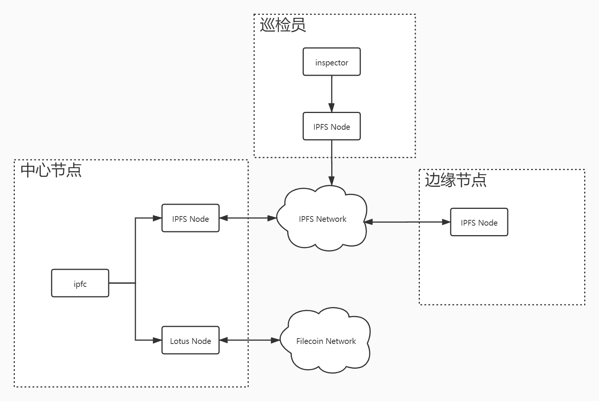

# ipfc

IPFC（Inter-Planetary File Cache） 星际文件缓存




### 部署依赖
- mysql
- ipfs
- lotus

### 编译代码
IPFS
```
clone https://github.com/filepp/go-ipfs
make build
```
IPFC
```
https://git.filep.vip/ruitai/ipfc
make
```

### 部署中心节点
运行ipfs，需要指定矿工钱包地址和矿工角色,(0代表中心节点)
```
ipfs init
ipfs daemon --enable-pubsub-experiment=true --enable-mining=true --miner-role=0
```
运行lotus（略）

运行ipfc, 需修改配置 `resource/ipfc.yaml`
运行ipfc，(ipfc和lotus必须运行同一台主机上，或者将IPFC的文件目录挂载到lotus主机上)
```
./ipfc
```

### 边沿节点
运行边沿节点，需要指定矿工钱包地址和矿工角色，(1代表边沿节点)
```
ipfs init
ipfs daemon --enable-pubsub-experiment=true --enable-mining=true --miner-role=1
```

### 巡检节点
运行ipfs
```
ipfs init
ipfs daemon --enable-pubsub-experiment=true
```

运行inspector
```
./inspector
```
